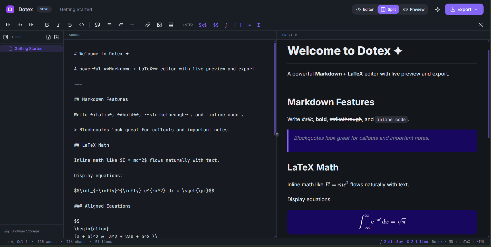

<div align="center">


# Dotex

**A beautiful, browser-based Markdown + LaTeX editor.**  
Live preview · Multi-file workspace · Export to PDF, HTML & MD · Google Drive sync

<br />



<br />

[](LICENSE)
[](https://react.dev)
[](https://vitejs.dev)
[](https://www.typescriptlang.org)

</div>

---

## ✦ Features

| | |
|---|---|
| **Markdown** | Full GFM : headings, bold, italic, strikethrough, tables, code blocks, blockquotes, footnotes |
| **LaTeX Math** | Inline `$…$` and display `$$…$$` via KaTeX : plus `align`, `matrix`, `cases` environments |
| **Mermaid Diagrams** | Flowcharts, sequence, class, state, ER, gantt, pie and more : rendered live and in PDF/HTML export |
| **Syntax Highlighting** | Highlighted code blocks via highlight.js : dark theme on screen, print-friendly light theme in export |
| **Find & Replace** | In-editor search with match navigation, case sensitivity, and replace-all (`Ctrl/⌘ F` · `Ctrl/⌘ H`) |
| **Live Split View** | Resizable editor / preview panes with synchronized scrolling |
| **Multi-file Workspace** | Create, rename, delete, and drag-and-drop files and folders in a collapsible sidebar |
| **Three Storage Backends** | Browser IndexedDB (default) · Local folder via File System Access API · Google Drive |
| **Export** | PDF (print dialog) · Standalone HTML · Raw Markdown |
| **Persistent Preferences** | View mode, dark mode, sidebar state, and last-open file survive page reload |
| **Performance** | Compile cache · `useDeferredValue` preview : editor stays responsive on large documents |
| **Responsive** | Vertical split and sheet sidebar on mobile |

---

## Getting Started

```bash
# Install dependencies
npm install

# Start the dev server (http://localhost:8080)
npm run dev
```

---

## Storage Backends

### Browser Storage (default)
Works instantly : no setup needed. Files live in your browser's IndexedDB. Up to several hundred MB depending on browser quota.

### Local Folder
Click the storage footer in the sidebar → **Mount Local Folder**.  
Requires Chrome or Edge (File System Access API). Reads and writes `.md`, `.txt`, and `.tex` files directly on disk.

### Google Drive
Stores all files in a **Dotex Notes** folder in your Drive. Setup:

1. **Enable the Drive API** in [Google Cloud Console](https://console.cloud.google.com) → Library → *Google Drive API* → Enable.
2. **Configure the OAuth consent screen** : External, add the `drive.file` scope.
3. **Create an OAuth 2.0 Client ID** : Web application type, add `http://localhost:8080` (and your production domain) as an authorized JavaScript origin.
4. **Add your credentials** : create a `.env` file in the project root:

```env
VITE_GOOGLE_CLIENT_ID=your-client-id.apps.googleusercontent.com
```

5. While the app is in *Testing* mode, add your Google account as a **Test User** in the OAuth consent screen settings.

---

## Keyboard Shortcuts

| Shortcut | Action |
|---|---|
| `Ctrl/⌘ B` | Bold |
| `Ctrl/⌘ I` | Italic |
| `Ctrl/⌘ \`` | Inline code |
| `Ctrl/⌘ Z` | Undo |
| `Ctrl/⌘ Y` / `Ctrl/⌘ Shift Z` | Redo |
| `Ctrl/⌘ F` | Find |
| `Ctrl/⌘ H` | Find & Replace |
| `Enter` / `Shift Enter` | Next / previous match |
| `Tab` | Insert 2-space indent |

---

## Export

| Format | How it works |
|---|---|
| **PDF** | Opens a print-ready HTML tab → use *Save as PDF* in the browser print dialog |
| **HTML** | Self-contained file with embedded KaTeX CSS and Google Fonts |
| **Markdown** | Raw `.md` source download |

---

## Build & Deploy

```bash
# Production build
npm run build

# Preview the build locally
npm run preview
```

The `dist/` folder is a static SPA. Deploy to any static host:

- **Vercel** : `vercel.json` with SPA rewrites is already included.
- **Netlify** : add a `_redirects` file: `/* /index.html 200`
- **GitHub Pages** : set the base in `vite.config.ts` if serving from a subdirectory.

---

## Tech Stack

- **React 18** + TypeScript
- **Vite 5** + SWC (fast builds)
- **Tailwind CSS** + shadcn/ui + Radix UI
- **marked** + **marked-footnote** : Markdown parsing (GFM, footnotes)
- **KaTeX** : LaTeX math rendering
- **Mermaid** : diagram rendering
- **highlight.js** : code syntax highlighting
- **DOMPurify** : HTML sanitization
- **react-resizable-panels** : resizable split views
- **IndexedDB** : default file storage
- **Google Identity Services** : OAuth2 token flow
- **Framer Motion** : animations

---

<div align="center">

Made with ✦ : MIT License

</div>
